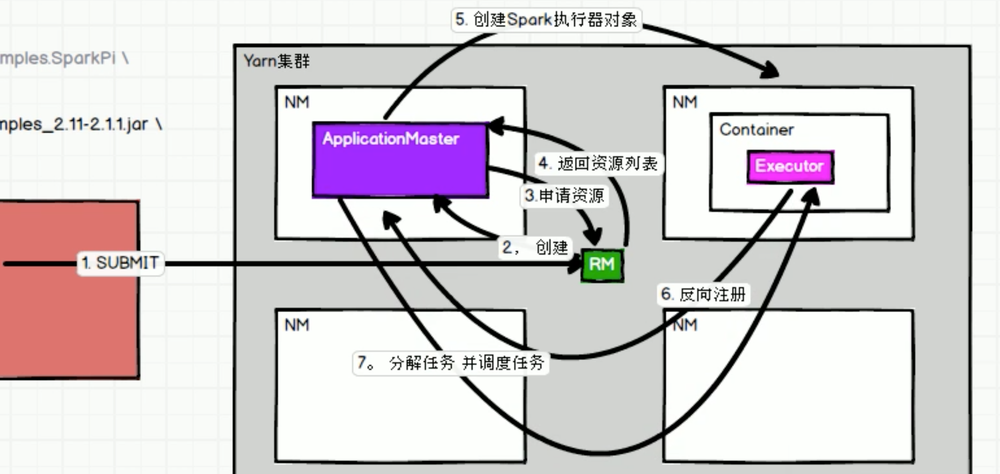

# spark-tut-parent

## environment settings
```text
1.maven
2.java 8
3.spark core/ml/sql
```

## repository notes

```text
初始化仓库
增加了maven pom files
增加了core核心例子
增加了spark ml分类和回归例子
增加了scala例子
增加了spark sql例子
```

## spark on yarn tips

```text
1.spark on yarn环境配置
    1.配置hadoop
    2.配置spark env
    3.开启yarn和hdfs
    4.发送jar到yarn,查看spark on yarn的命令
2.yarn-client和yarn-cluster两种模式
3.spark on yarn的启动命令
模式
    ./bin/spark-submit --class path.to.your.Class --master yarn 
        --deploy-mode cluster [options] <app jar> [app options]
命令
    ./bin/spark-submit --class org.apache.spark.examples.SparkPi \
        --master yarn \
        --deploy-mode cluster或client \
        --driver-memory 4g \
        --executor-memory 2g \
        --executor-cores 1 \
        --queue thequeue \
        lib/spark-examples*.jar \
        10
spark-shell也可以直接运行yarn模式
    cd $SPARK_HOME/bin
    ./spark-shell \
    --master yarn-client \
    --executor-memory 1G \
    --num-executors 10
4.spark on yarn的执行流程图
```


```text
5.打包相关的插件(直接见maven pom.xml)
6.文件的查找方式，一句运行环境
    本地文件：file:///opt/in
    yarn可以直接把数据放在input
    查看yarn数据源
```


